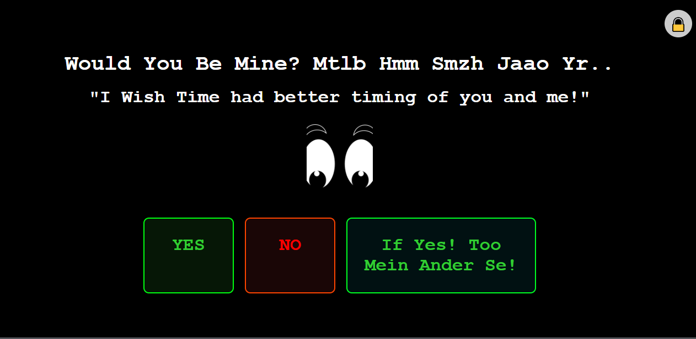
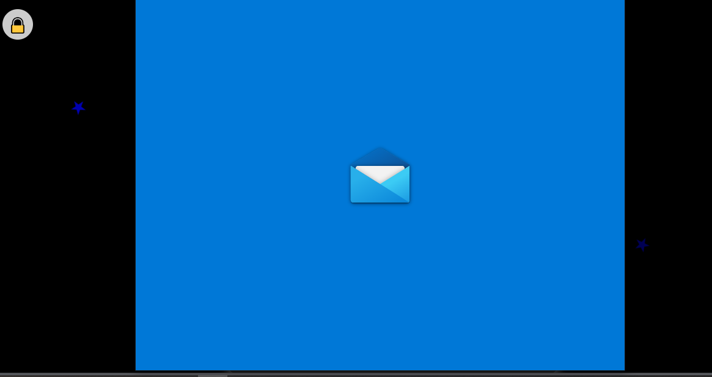

<h1 style="text-align: center;">Would__YoU__BeMine-</h1>

 **"An interactive 💻 web project that asks the ultimate question: Would you be mine? 💖 Featuring playful animations, responsive design, and a bit of coding magic! ✨"**  Feel free to tweak it to match your style!

Here’s a detailed **GitHub repository information** template, including theories, sections, and a gallery for your project:

---

<h1 style="text-align: center;">Would You Be Mine? 💖</h1>


---

## 📖 **Introduction**

**"Would You Be Mine?"** is a playful and interactive web-based project aimed at helping introverts express their emotions more easily in today's fast-paced world. This fun, quirky project offers a digital platform to ask that all-important question without the anxiety or awkwardness of face-to-face conversations.

Introverts often struggle with initiating conversations or expressing romantic interest. This project acts as a bridge between technology and emotions, creating a safe, comfortable space for communication.

---

## 🌟 **Features**

- **Responsive Design:** Works seamlessly across all devices – desktops, tablets, and smartphones.
- **Interactive YES/NO Buttons:** The NO button moves when hovered over, adding a playful twist.
- **Email Notification:** Sends a customized email via **EmailJS** if the "YES" button is clicked.
- **Hover Animations:** Fun animations and glowing effects make the interface engaging.
- **Privacy Button:** Adds an element of mystery, with an interactive privacy feature.

---

## 🔧 **Technologies Used**

- **HTML5** and **CSS3**: Structuring and styling the project.
- **JavaScript**: Adding interactive functionality, such as button animations, redirection, and email sending.
- **EmailJS**: Integration for sending personalized emails when actions are performed.
- **Responsive Design**: Using media queries to ensure the project is adaptable on all devices.
- **Web Animations**: CSS animations to enhance interactivity and engagement.

---

## 🎯 **Problem Statement: Introvert's Struggles**

For introverts, expressing feelings—especially romantic ones—can be daunting. Social anxiety, shyness, or the fear of rejection often prevent introverts from making the first move. This project addresses the problem by offering a light-hearted, humorous approach, making it easier to connect and communicate.

---

## 💡 **Solution: Fun, Digital Icebreaker**

**"Would You Be Mine?"** provides a fun, non-intrusive way to pop the question digitally. Instead of putting pressure on introverts to express their feelings in person, this project gives them a safe digital space to engage with others in a playful, less stressful manner.

---

## 🎨 **Project Gallery**

### 1. Main UI: Asking the Question


### 2. Playful NO Button


### 3. Interactive Cards




### 4. YES & NO Button (NO Button-Trigger)


### 5. Yes Button (Email Trigger)


### 6. GPL Liscence (Policy & Privacy)


---

## 🛠️ **Setup and Installation**

1. **Clone the repository:**
   ```bash
   git clone https://github.com/YourUsername/WouldYouBeMine.git
   ```
2. **Navigate into the project directory:**
   ```bash
   cd WouldYouBeMine
   ```
3. **Open the project in your favorite code editor (e.g., VS Code):**
   ```bash
   code .
   ```
4. **Run the project:**  
   Simply open the `index.html` file in your browser to experience the magic!

---

## 🎉 **How It Works**

- **YES Button:** When clicked, an email is sent using **EmailJS**, confirming the positive response.
- **NO Button:** The NO button cleverly dodges the user's mouse, making it difficult to click.
- **Animated Cards:** Each card has interactive animations to enhance user experience.
- **Privacy Button:** A hidden feature that adds more mystery.

---

## 🚀 **Benefits**

- **For Introverts:** Offers a fun and less intimidating way to express feelings.
- **Interactive & Engaging:** The design elements make the whole experience playful and lighthearted.
- **Mobile-Friendly:** Works flawlessly across different devices, so you can access it from anywhere.
- **Email Integration:** Sends confirmation emails directly through the **EmailJS** service.
  
---

## 🏆 **Future Improvements**

- **Multilingual Support:** Adding more languages to increase accessibility.
- **Custom Themes:** Offering different color schemes or themes for users.
- **Backend Support:** Connecting with a database to store responses and user data.

---

## 💻 **Contributors**

- **Dhruv Dhayal** – Developer and Creator  
   [Instagram](https://www.instagram.com/dhayaldhruv271/?hl=en) | [LinkedIn](https://www.linkedin.com/in/dhruv-dhayal/)

---

## 📄 **License**

This project is licensed under the MIT License – see the [LICENSE](LICENSE) file for more details.

---

## 🖼️ **Screenshots**

<p>Here's a peek into what the project looks like:</p>

<div style="display: flex; justify-content: center; flex-wrap: wrap; margin: 20px;">
    <div style="margin: 10px; width: 200px; border: 1px solid #ccc; border-radius: 10px; overflow: hidden; text-align: center;">
        
    </div>
    <div style="margin: 10px; width: 200px; border: 1px solid #ccc; border-radius: 10px; overflow: hidden; text-align: center;">
        
    </div>
    <div style="margin: 10px; width: 200px; border: 1px solid #ccc; border-radius: 10px; overflow: hidden; text-align: center;">
        
    </div>
    <div style="margin: 10px; width: 200px; border: 1px solid #ccc; border-radius: 10px; overflow: hidden; text-align: center;">
        
    </div>
</div>


---

## 🌐 **Live Demo**

Check out the live demo of the project here: **[MyFeelingForU](https://blocknotes-4515.github.io/MyFeelingsForU/)**

---

## ✨ **Contact**

Feel free to reach out for collaboration or suggestions:

- **Email:** [dhayaldhruv271@gmail.com](mailto:dhayaldhruv271@gmail.com)
- **Instagram:** [@dhayaldhruv271](https://www.instagram.com/dhayaldhruv271/?hl=en)
- **LinkdinL** [On-Linkdin-Connect](https://www.linkedin.com/in/dhruv-dhayal-9568b7262/)
- **Twitter** [On_X_Twitter](https://x.com/DhayalDhruv)
- **GitHub** [LiveDeploying-GitHub](https://github.com/BlockNotes-4515)

---

This should give your GitHub repository a polished and professional Information about the Project!

-From "DHRUV DHAYAL 💖"

<div style="text-align: center; margin-top: 20px;">
    <p>@copyright DDCo.Ltd.Pvt <br> Cooperated Mined By: DhruvDhayal Coorporations Limited!</p>
</div>

